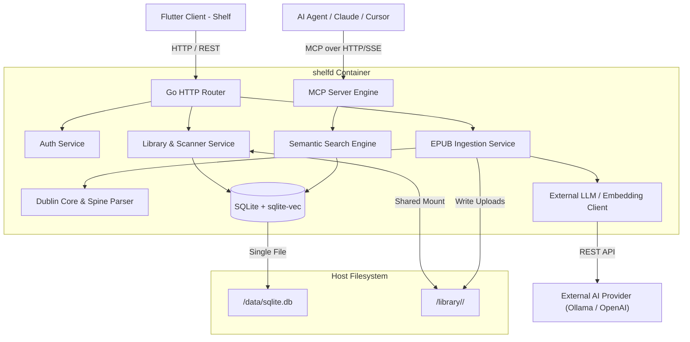

# Shelfd: Technical Design Document

## 1. System Architecture Overview



---

## 2. Storage & Filesystem Layout

### Container Mounts
* `/data`: Persistent state directory owned exclusively by `shelfd`.
  * `/data/sqlite.db`: Single-file SQLite database containing relational schema and vector index.
  * `/data/covers/`: Cached book covers extracted from EPUB packages (`{book_id}.jpg`).
* `/library`: Shared book collection mounted read-write.
  * Preserves Audiobookshelf structure: `/library/<Author>/<Title>/<Title>.epub`.
  * Uploaded books are placed here so Audiobookshelf can automatically catalog them.
* `/config.yaml`: Mounted read-only configuration file.

---

## 3. Database Schema (`sqlite-vec`)

```sql
-- Core users
CREATE TABLE users (
    id TEXT PRIMARY KEY,
    username TEXT UNIQUE NOT NULL,
    password_hash TEXT NOT NULL,
    created_at DATETIME DEFAULT CURRENT_TIMESTAMP
);

-- API tokens for MCP and external clients
CREATE TABLE api_tokens (
    id TEXT PRIMARY KEY,
    user_id TEXT NOT NULL REFERENCES users(id) ON DELETE CASCADE,
    token_hash TEXT NOT NULL,
    name TEXT NOT NULL,
    created_at DATETIME DEFAULT CURRENT_TIMESTAMP
);

-- Normalized Authors
CREATE TABLE authors (
    id TEXT PRIMARY KEY,
    name TEXT NOT NULL UNIQUE COLLATE NOCASE,
    created_at DATETIME DEFAULT CURRENT_TIMESTAMP
);

-- Normalized Genres / Subjects
CREATE TABLE genres (
    id TEXT PRIMARY KEY,
    name TEXT NOT NULL UNIQUE COLLATE NOCASE,
    created_at DATETIME DEFAULT CURRENT_TIMESTAMP
);

-- Normalized Series
CREATE TABLE series (
    id TEXT PRIMARY KEY,
    name TEXT NOT NULL UNIQUE COLLATE NOCASE,
    description TEXT,
    created_at DATETIME DEFAULT CURRENT_TIMESTAMP
);

-- Book metadata
CREATE TABLE books (
    id TEXT PRIMARY KEY,
    title TEXT NOT NULL,
    description TEXT,
    language TEXT,
    publisher TEXT,
    identifier TEXT,
    file_path TEXT NOT NULL,       -- Path relative to /library
    cover_path TEXT,              -- Path relative to /data/covers
    file_size_bytes INTEGER,
    published_date TEXT,
    created_at DATETIME DEFAULT CURRENT_TIMESTAMP
);

-- Junction: Books <-> Authors
CREATE TABLE book_authors (
    book_id TEXT NOT NULL REFERENCES books(id) ON DELETE CASCADE,
    author_id TEXT NOT NULL REFERENCES authors(id) ON DELETE CASCADE,
    role TEXT DEFAULT 'author',
    PRIMARY KEY (book_id, author_id)
);
CREATE INDEX idx_book_authors_author ON book_authors(author_id);

-- Junction: Books <-> Genres
CREATE TABLE book_genres (
    book_id TEXT NOT NULL REFERENCES books(id) ON DELETE CASCADE,
    genre_id TEXT NOT NULL REFERENCES genres(id) ON DELETE CASCADE,
    PRIMARY KEY (book_id, genre_id)
);
CREATE INDEX idx_book_genres_genre ON book_genres(genre_id);

-- Junction: Books <-> Series
CREATE TABLE book_series (
    book_id TEXT NOT NULL REFERENCES books(id) ON DELETE CASCADE,
    series_id TEXT NOT NULL REFERENCES series(id) ON DELETE CASCADE,
    sequence_number REAL,
    PRIMARY KEY (book_id, series_id)
);
CREATE INDEX idx_book_series_seq ON book_series(series_id, sequence_number);

-- Chapters (Spine & Content)
CREATE TABLE chapters (
    id TEXT PRIMARY KEY,
    book_id TEXT NOT NULL REFERENCES books(id) ON DELETE CASCADE,
    chapter_index INTEGER NOT NULL,
    title TEXT,
    summary TEXT NOT NULL,
    content_plain TEXT NOT NULL,
    created_at DATETIME DEFAULT CURRENT_TIMESTAMP
);
CREATE INDEX idx_chapters_book ON chapters(book_id, chapter_index);

-- Paragraphs (Passage Chunks)
CREATE TABLE paragraphs (
    id TEXT PRIMARY KEY,
    book_id TEXT NOT NULL REFERENCES books(id) ON DELETE CASCADE,
    chapter_id TEXT NOT NULL REFERENCES chapters(id) ON DELETE CASCADE,
    chapter_index INTEGER NOT NULL,
    start_paragraph INTEGER NOT NULL,
    end_paragraph INTEGER NOT NULL,
    content TEXT NOT NULL,
    created_at DATETIME DEFAULT CURRENT_TIMESTAMP
);
CREATE INDEX idx_paragraphs_book ON paragraphs(book_id);
CREATE INDEX idx_paragraphs_chapter ON paragraphs(chapter_id, chapter_index);

-- Virtual Vector Table (256 float embeddings)
CREATE VIRTUAL TABLE vec_paragraphs USING vec0(
    paragraph_id TEXT PRIMARY KEY,
    embedding float[256]
);

-- Full-Text Search (FTS5)
CREATE VIRTUAL TABLE paragraphs_fts USING fts5(
    paragraph_id UNINDEXED,
    book_id UNINDEXED,
    chapter_id UNINDEXED,
    content
);
```

---

## 4. MCP Server & Tool Specification

* **Protocol**: Model Context Protocol over HTTP/SSE.
* **Endpoints**:
  * `GET /mcp/sse`: Handshake stream. Declares JSON-RPC endpoint.
  * `POST /mcp/messages`: Message ingestion endpoint.

### Exposed Tools
1. **`search_library`**:
   * Semantic vector search across 256-dimension paragraph embeddings.
   * Parameters:
     * `query` (string, required): Natural language search prompt.
     * `author` (string, optional): Author name filter.
     * `genre` (string, optional): Genre filter.
     * `series` (string, optional): Series name filter.
     * `limit` (int, default 5): Top K results.
   * Returns: List of search hits with book title, author, chapter title, paragraph range (`Paragraphs 14–16`), score, and excerpt (< 100 tokens).
2. **`get_book_metadata`**:
   * Retrieves complete book details, TOC, and all chapter summaries.
   * Parameters: `book_id` (string, required).
3. **`read_chapter_content`**:
   * Reads plain text for a specific chapter with windowing.
   * Parameters:
     * `book_id` (string, required)
     * `chapter_index` (int, required)
     * `start_paragraph` (int, optional)
     * `end_paragraph` (int, optional)

---

## 5. Deployment Configuration (`config.yaml`)

```yaml
server:
  host: "0.0.0.0"
  port: 8080
  jwt_secret: "replace-with-secure-random-key"

database:
  type: "sqlite" # "sqlite" or "postgres"
  sqlite:
    path: "/data/sqlite.db"
  postgres:
    dsn: ""

storage:
  library_dir: "/library"
  data_dir: "/data"

ai:
  provider: "ollama" # "ollama" or "openai"
  base_url: "http://host.docker.internal:11434"
  api_key: ""
  embedding_model: "nomic-embed-text"
  embedding_dimensions: 256
  summary_model: "llama3.2:3b"

mcp:
  enabled: true
  path: "/mcp"
```
